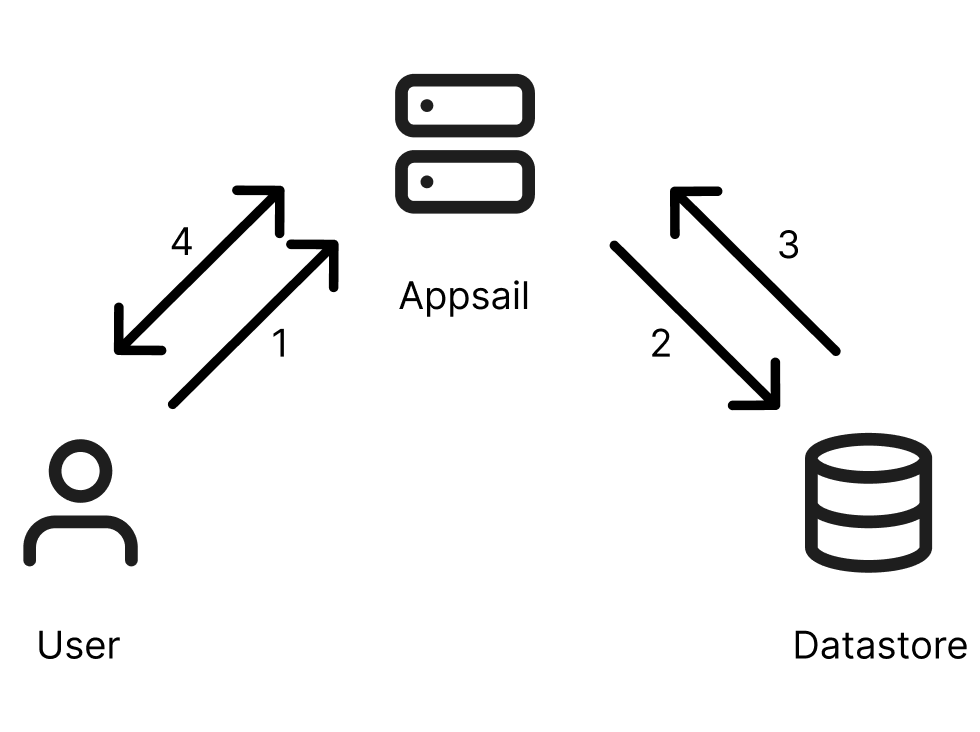

# Getting Started

This is an example Python application built with Flask (a microservice framework) that can be deployed on Catalyst Appsail.

### Prerequisites

To deploy this application, you must satisfy the following requirements:

* Catalyst Account
* Catalyst CLI installed and logged in
* Knowledge of Catalyst Datastore and ZCQL
* Python 3.9 installed on your local system
* Knowledge of PyPI and pip
* Basic understanding of git

### Components

This application will use the following Catalyst components:

1. **Serverless -> Appsail** : PaaS offering from Catalyst for all your compute needs.
2. **CloudScale -> Datastore** : A relational data storage component for storing table data.

### Working

1. The user will input credentials, which will be checked against the credentials stored in Catalyst Datastore.
2. Once authenticated, the user can upload a CSV in the UI, which will then be visualized in the UI.



# Usage

To deploy this application to your Catalyst account, follow these steps:

1. Download the code using the following command:
   ```
   git clone https://github.com/rengarajan01/catalyst-python-webinar.git
   ```
2. Once downloaded, navigate to the `appsail-python` directory and create a virtual environment with the following command:
   ```
   python -m venv .venv
   ```
3. After creating the virtual environment, activate it with the following command:
   ```
   source .venv/bin/activate
   ```
4. Install the dependencies with the following command:
   ```
   pip install -r requirements.txt
   ```
5. Once the dependencies are installed, go to the [Catalyst console](https://console.catalyst.zoho.com "Catalyst by Zoho"), create a new project, and navigate to CloudScale -> Datastore -> Create Table.
6. Create a table named "Users" with the columns "USERNAME" (data type: text) and "PASSWORD" (data type: Encrypted Text).
7. Go to Data View and insert a new record for the username and password.
8. In your local environment, initialize the Catalyst project inside your `appsail-python` directory. Once Appsail is initialized with Appsail and Python 3.9 as the runtime, replace the value for the key `command` inside `app-config.json` with:
   ```
   python app.py
   ```
9. You can now serve the application locally with the `catalyst serve` command or deploy the application with the `catalyst deploy` command.
10. Use [this file](https://workdrive.zohoexternal.com/file/29ha122f797b7e7704e00938cd51c74bfd4f6 "Test CSV File") for your testing.

[Live demo](https://appsail-10085182734.development.catalystappsail.com/ "Python App")

Demo Credentials:
Username: demo
Password: demo
